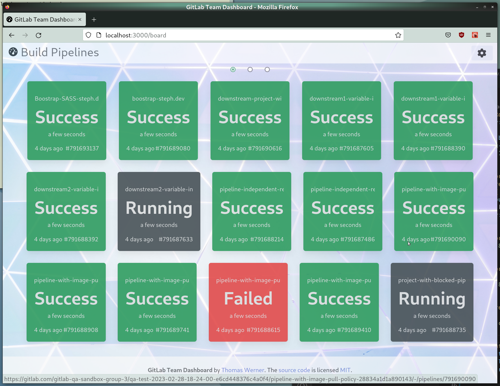
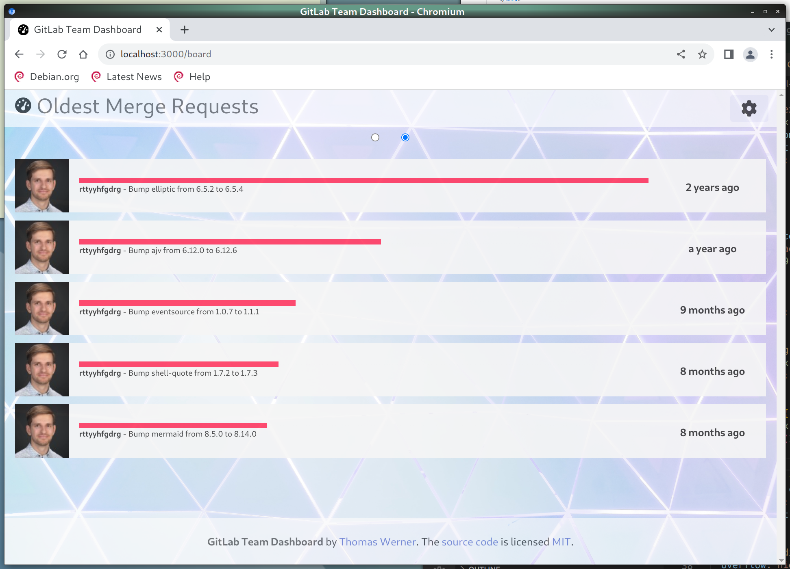
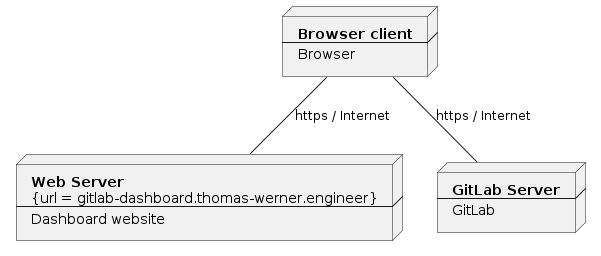

# GitLab Team Dashboard

This is a dynamic dashboard that displays the status of development projects managed in GitLab (on site or in the cloud). The dashboard is designed to be displayed on a TV screen or some large display. 

The dashboard loops through multiple views. These views currently are:

*   **Status of CI/CD Pipelines**  
    
*   **List of oldest open Merge Requests**  
    

## Build 

### Requirements

*   [Node.js](https://nodejs.org) version 18 or newer
*   npm

### Steps

*   Get the source code
*   Open a shell and change into root folder of project
*   Run `npm i` to install dependencies
*   Run `npm run build` to generate static pages
*   Now deploy content of the *build* folder to some web server

## Hosted version

No need to build and host the dashboard yourself - unless you want to extend or adapt the source code. You can always find the latest version at https://gitlab-dashboard.thomas-werner.engineer.

## Security

The dashboard is designed to run entirely in the browser and is not dependent on a backend server. Configuration data - like credentials - and the dashboard data itself are stored in the local storage of the browser. This simplifies the deployment and operation of the dashboard and ensures that sensitive information does not fall into unauthorised hands.

